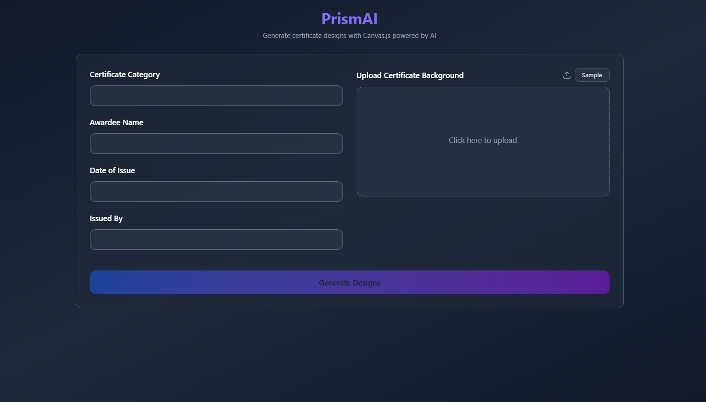

# PrismAI

Prism Certificate Generator is a robust and dynamic web application designed to simplify the process of creating professional certificates. This application leverages the power of LLM to analyze user-provided inputs and generate five distinct certificate designs. Each design is rendered using Canvas.js and comes with its corresponding copyable Canvas.js code for further customization.



## Setup Steps ➡️

### Prerequisites
- Node.js 18+
- npm or yarn
- Google Gemini API key (or any other LLM)

### Installation
1. **Clone the repository**
   ```bash
   git clone https://github.com/Shubho7/prism.git
   cd prism
   ```

2. **Install dependencies**
   ```bash
   npm install
   ```

3. **Set up environment variables**
   Create a `.env` file in the root directory and add your API key:
   ```env
   GEMINI_API_KEY=your_gemini_api_key_here
   ```

4. **Run the development server**
   ```bash
   npm run dev
   ```

## How It Works ⚙️

### User Input
- The user provides the certificate category (e.g., "Summer Code Camp Certificate", "AI for Farmers") and uploads a certificate background image. Alternatively, users can generate a sample background using the built-in generator.
- Awardee Name
- Date of Issue
- Issued By

### AI-Powered Design Generation
- The uploaded image and category name are sent to the Google Gemini LLM (`gemini-2.0-flash`).
- The LLM acts as a creative designer, analyzing the image and generating five distinct design blueprints. Each blueprint includes:
  - Design elements: color palette, font combinations, layout, icons, and styles.
  - Textual content: Appropriate title and body text appreciating the awardee, 
- The LLM returns a well-structured JSON object containing these blueprints.

### Certificate Rendering
- The application maps the JSON blueprints to Canvas.js to render the designs.
- For each design, the uploaded background image is drawn onto the `<canvas>` element.
- Canvas.js dynamically applies the design elements and textual content specified in the JSON object, using properties like `ctx.fillStyle`, `ctx.font`, and `ctx.fillText()`.

### Preview and Customization
- Users can preview all five designs in the Certificate Preview Area.
- Each design includes a copyable Canvas.js code section beneath each design.
- Certificates can be downloaded as PNG images.

## Tech Stack </>

### Frontend
- **Next.js**: Framework used for building the application.
- **TypeScript**: Ensures type safety and robust development.
- **TailwindCSS**: Provides styling for a sleek and modern UI.
- **shadcn/ui**: Enhances the UI with reusable components.

### Backend
- **Google Gemini API**: Powers the AI-driven design generation.
- **Next.js API Route**: Handles server-side logic and communication with the LLM.

### Rendering
- **Canvas.js**: Renders the certificate designs dynamically based on the JSON objects.

## Additional Features
- **Error Handling**: Robust fallback system with pre-designed templates.
- **Image Processing**: Validates and resizes uploaded images to `Base64` for optimal performance.
- **Sample Background Generator**: Allows users to test the application without uploading an image.